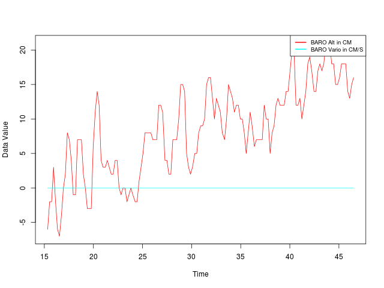

## mspLog.py

MSP (http://www.multiwii.com/wiki/index.php?title=Multiwii_Serial_Protocol) logging through a telemetry link.

mspLog will gather data on a serial port and write it to a standard CSV format

Licensed under the GPLv2

## running

No non-standard python libraries are needed, simply clone/download the repo and run:

```
python mspLog.py SERIALPORT BAUDRATE
```

I use this on Linux, BAUDRATE is optional.

```
git clone https://github.com/andrewhodel/mspLog.git
cd mspLog
python mspLog.py /dev/ttyUSB0
```

You will see something similar to the following:

```
> python mspLog.py /dev/ttyUSB0
/dev/ttyUSB0 Opened
Waiting for data to flow
Polling at 0.1s intervals
Writing to output.csv at 0.2s intervals
Use Ctrl-C to exit
Collecting Data for 8 seconds
```

## example CSV output

mspLog.py will write the CSV output to a file in it's directory named output.csv, here is an example.

The first line represents the MSP command which that row's data contains.  Each command may have multiple fields like MSP_RAW_IMU0, MSP_RAW_IMU1, etc which can be looked up here - http://www.multiwii.com/wiki/index.php?title=Multiwii_Serial_Protocol

```
MSP_RC0,MSP_RC1,MSP_RC2,MSP_RC3,MSP_RC4,MSP_RC5,MSP_RC6,MSP_RC7,MSP_ALTITUDE0,MSP_ALTITUDE1,MSP_RAW_IMU0,MSP_RAW_IMU1,MSP_RAW_IMU2,MSP_RAW_IMU3,MSP_RAW_IMU4,MSP_RAW_IMU5,MSP_RAW_IMU6,MSP_RAW_IMU7,MSP_RAW_IMU8,MSP_RAW_GPS0,MSP_RAW_GPS1,MSP_RAW_GPS2,MSP_RAW_GPS3,MSP_RAW_GPS4,MSP_RAW_GPS5,MSP_RAW_GPS6,MSP_ATTITUDE0,MSP_ATTITUDE1,MSP_ATTITUDE2,MSP_MOTOR0,MSP_MOTOR1,MSP_MOTOR2,MSP_MOTOR3,MSP_MOTOR4,MSP_MOTOR5,MSP_MOTOR6,MSP_MOTOR7,DATETIME
1500,1500,1500,1500,1500,1500,1500,1500,-6,0,-3,2,511,0,0,0,257,117,417,0,0,0,0,0,0,0,-1,2,-61,1000,1000,1000,1000,0,0,0,0,2014-07-14 14:34:15.339242
1500,1500,1500,1500,1500,1500,1500,1500,-2,0,-3,1,511,0,0,0,257,118,417,0,0,0,0,0,0,0,-1,2,-61,1000,1000,1000,1000,0,0,0,0,2014-07-14 14:34:15.539608
1500,1500,1500,1500,1500,1500,1500,1500,-2,0,-3,2,511,0,0,0,256,117,419,0,0,0,0,0,0,0,-1,2,-61,1000,1000,1000,1000,0,0,0,0,2014-07-14 14:34:15.739949
1500,1500,1500,1500,1500,1500,1500,1500,3,0,-3,2,511,0,0,0,257,116,417,0,0,0,0,0,0,0,-1,2,-61,1000,1000,1000,1000,0,0,0,0,2014-07-14 14:34:15.940263
1500,1500,1500,1500,1500,1500,1500,1500,-2,0,-3,2,510,0,1,0,256,117,418,0,0,0,0,0,0,0,-1,3,-61,1000,1000,1000,1000,0,0,0,0,2014-07-14 14:34:16.140580
1500,1500,1500,1500,1500,1500,1500,1500,-6,0,-3,2,511,0,0,0,257,118,419,0,0,0,0,0,0,0,-1,3,-61,1000,1000,1000,1000,0,0,0,0,2014-07-14 14:34:16.340917
```

## parsing CSV output with R

Here's a simple script that you can use with R to quickly generate graphs from your data. http://www.r-project.org/

This example is simply plotting Altitude data from the Barometer, but you can easily plot any data in the CSV files by changing **datap** and **lnames** to represent the data you want.

```
# load csv
a <- read.csv("/home/user/mspLog/output.csv")

# set to TRUE to write to a png file
OUTPNG=FALSE
if (OUTPNG) {
  png("/home/user/mspLog/graph.png", width = 640, height = 480)
}

# data to plot
datap <- list(a$MSP_ALTITUDE0, a$MSP_ALTITUDE1)

# legend names
lnames <- c("BARO Alt in CM", "BARO Vario in CM/S")

# get ranges
g_range <- range(datap)

col <- rainbow(length(datap))

for (i in 1:length(datap)) {
  if (i == 1) {
    plot(as.POSIXlt(a$DATETIME,format="%Y-%m-%d %H:%M:%OS"), datap[[i]], xlab='Time', ylab='Data Value', type='l', col=col[i], ylim=g_range)
  } else {
    lines(as.POSIXlt(a$DATETIME,format="%Y-%m-%d %H:%M:%OS"), datap[[i]], type='l', col=col[i])
  }
}

legend("topright", lnames, cex=0.8, col=col, lty=1, lwd=2, bty="o")

if (OUTPNG) {
  # flush png device
  dev.off()
}

```

## sample graph from R


